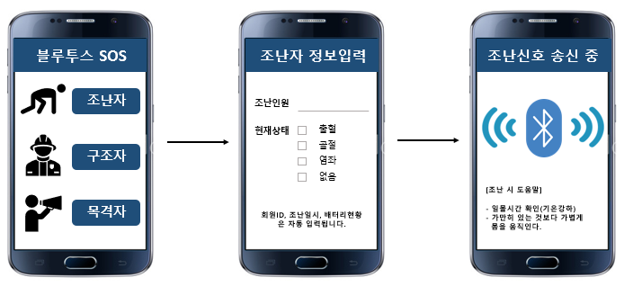

## BLE 재난구조 시스템

---

### 🖥️ 프로젝트 소개

- 기간 : 2019.01 ~ 2019.06
- 에스비시스템즈와 협력하여 수행한 졸업 프로젝트입니다.
- 네트워크가 단절된 재난상황에서 스마트폰 BLE를 활용하여 조난자와 구조자가 통신할 수 있는 시스템을 구현하고자 했습니다.

### 💡 구현 기능

- 조난 신호 송신
    - 조난자 → BLE 패킷에 조난 상황 정보를 담아 주변에 송신 (Advertising)
    - BLE 4 → 최대 31 Bytes
    - BLE 5 → 최대 255 Bytes
- 조난 신호 탐색
    - 구조자 → 주변의 BLE 조난 신호를 탐색 (Scanning) → 조난자와 페어링
    - BLE 신호 세기(RSSI) → 조난자와 구조자 간의 거리 측정
- 채팅
    - 조난자와 구조자 간의 스마트폰 페어링 → 채팅
- 조난자 위치 측정
    - 앞서 측정한 거리 → 삼각측량법 적용 → 위치 측정
- 신호 재전송
    - Raspberry Pi → 여러 기기를 설치해 조난 신호를 재전송하여 신호 범위 확장
    - Raspberry Pi, LED → BLE 재전송 과정 시각화

### 🏆 성과

- 학과 3등 (A0)

### 🛠️ 기술 스택

- BLE 4, 5
- Android Studio
- Raspberry Pi
- FireBase

### 🙋🏻‍♂️ 담당 역할 

- Android 개발 (80%)
    - BLE Advertising
    - BLE Scanning
    - BLE Chatting
    - UI

### 📸 결과 화면

- 조난 신호 송신 

- 조난 신호 탐색 + 위치 측정 

- 채팅 

- 신호 재전송 

